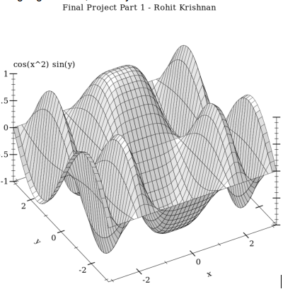

# Final Project Assignment 1: Exploration (FP1) 
DUE March 25, 2015 Wednesday (2015-03-25)

<p align="center">
  
</p>

```
#lang racket

(require plot)

(plot3d (surface3d (λ (x y) (* (cos (* x x)) (sin y)))
                     (- pi) pi (- pi) pi)
          #:title "Final Project Part 1 - Rohit Krishnan"
          #:x-label "x" #:y-label "y" #:z-label "cos(x) sin(y)")
```

### Plot Library

Using the plot library is super easy! I started by going to the [Racket Plot Documentation] and
I was able to draw this 3D shape which rendered a graph of an equation which is hard coded in the 
racket code. 

### How to Do and Submit this assignment

1. To start, [**fork** this repository][forking].
1. You might want to [**Clone**][ref-clone] this repository to your computer
  2. (This assignment is just one README.md file, so you can edit it right in github without cloning if you like)
1. Modify the README.md file and [**commit**][ref-commit] changes to complete your solution.
1. [**Push**][ref-push]/sync the changes up to your GitHub (skip this if you didn't clone)
1. [Create a **pull request**][pull-request] on the original repository to turn in the assignment.

<!-- Links -->
[Racket Plot Documentation]: http://docs.racket-lang.org/plot/intro.html#%28part._.Plotting_2.D_.Graphs%29

[piazza]: https://piazza.com/class/i55is8xqqwhmr?cid=411
[markdown]: https://help.github.com/articles/markdown-basics/
[forking]: https://guides.github.com/activities/forking/
[ref-clone]: http://gitref.org/creating/#clone
[ref-commit]: http://gitref.org/basic/#commit
[ref-push]: http://gitref.org/remotes/#push
[pull-request]: https://help.github.com/articles/creating-a-pull-request
