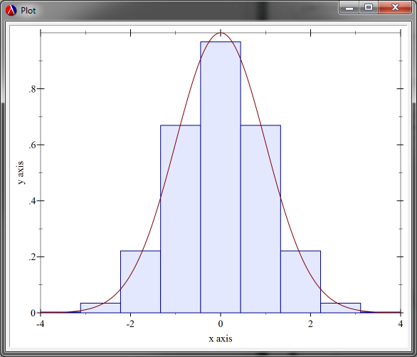
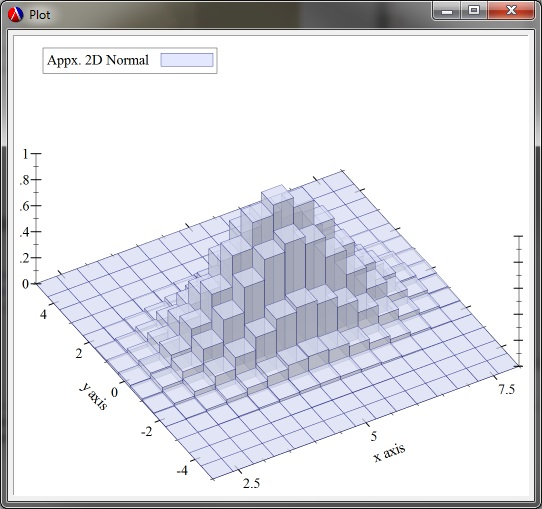

# Final Project Assignment 1: Exploration (FP1) 
DUE March 25, 2015 Wednesday (2015-03-25)

### My Library: Plot
Brian Carlson

 I chose to explore the `Plot` library. This library handles 2D and 3D graphing renders in Racket. I browsed around at some of the functionality that was available with the library, and what types of graphs you could make. They give very detailed information on how to use their procedures, and many of them. I first looked at some different 2D graph types, you can make a simple plot by invoking the following:
 
 ```
(require plot) ; Plot library
(plot-new-window? #t) ; Provides a separate window outside of the interpreter

(define (square x) (* x x)) ; simple function to graph

> (plot (function square (- 10) 10 #:label "square(x)" ) )

 ```
 
  Plot Window.")
 
 This call to plot provides an x-range of -10 to 10, and a label of the line being graphed. The plot can also be zoomed in on and moved around. There are many other parameters that can be adjusted in the plot such as: x-label, y-label, width, etc.
 
 Other graph types are available as well, such as histograms/bar charts. There was a pretty neat example that estimated the area under a curve using a sequence of histograms.
 
 ```
 
 (require (only-in plot/utils linear-seq))
 (define (f x) (exp (* -1/2 (sqr x))))
 (plot (list (area-histogram f (linear-seq -4 4 10))
               (function f -4 4)))
			
```



This exampled an interesting interplay of the graphs and possibilities of more data acquisition from other data that is graphed. There are also some nice isometric 3D renders that can be made as well. They had another example of histogram over numerous axis, representing a type of force displacement. The code for it is quite long, so I won't garble the file with it.



Overall, this library provides a very straight forward, easy to understand procedures and utilities for graphing simple or complex data, quickly and easily.